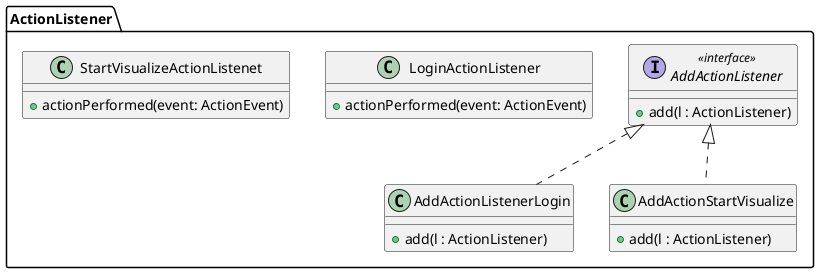

```plantuml
@startuml

namespace ActionListener {
    class AddActionListenerLogin implements AddActionListener
    class AddActionStartVisualize implements AddActionListener

    interface AddActionListener <<interface>>{
        + add(l : ActionListener)
    }

    class AddActionListenerLogin {
        + add(l : ActionListener)
    }

    class AddActionStartVisualize {
        + add(l : ActionListener)
    }

    class LoginActionListener {
        + actionPerformed(event: ActionEvent)
    }

    class StartVisualizeActionListenet {
        + actionPerformed(event: ActionEvent)
    }
}

@enduml
```