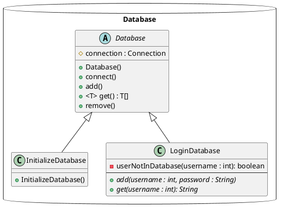

```plantuml
@startuml

package Database <<Database>> {
    abstract class Database {
        # connection : Connection  
        + Database()
        + connect()
        + add()
        + <T> get() : T[]
        + remove()
    }

    class InitializeDatabase {
        + InitializeDatabase()
    }

    class LoginDatabase{
        - userNotInDatabase(username : int): boolean
        --
        {abstract} + add(username : int, password : String)
        {abstract} + get(username : int): String
    }

Database <|-- InitializeDatabase
Database <|-- LoginDatabase
}

@enduml
```