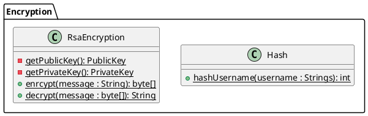

```plantuml
@startuml

namespace Encryption {
    class Hash {
        {static} + hashUsername(username : Strings): int
    }

    class RsaEncryption {
        {static} - getPublicKey(): PublicKey
        {static} - getPrivateKey(): PrivateKey
        {static} + enrcypt(message : String): byte[]
        {static} + decrypt(message : byte[]): String
    }
}

@enduml
```