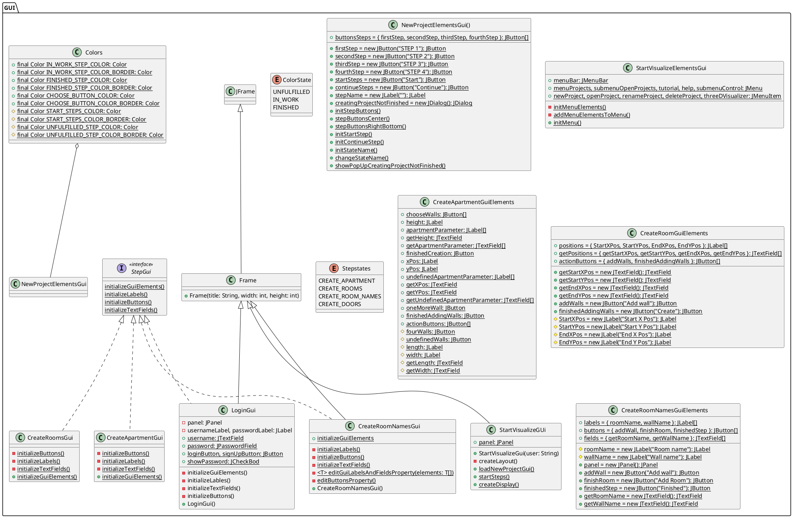

```plantuml
@startuml

namespace GUI {
    class Frame extends JFrame {
        + Frame(title: String, width: int, height: int)
    }

    class LoginGui extends Frame implements StepGui{
            - panel: JPanel
            - usernameLabel, passwordLabel: JLabel
            {static} + username: JTextField        
            {static} + password: JPasswordField         
            {static} + loginButton, signUpButton: JButton       
            {static} + showPassword: JCheckBod
            - initializeGuiElements()
            - initializeLables()
            - initializeTextFields()
            - initializeButtons()
            + LoginGui()
        }
    
    class StartVisualizeGUi extends Frame {
        {static} + panel: JPanel
        + StartVisualizeGui(user: String)
        - createLayout()
        {static} + loadNewProjectGui()
        {static} + startSteps()
        {static} + createDisplay()
    }

    class Colors {
        {static} + final Color IN_WORK_STEP_COLOR: Color
        {static} + final Color IN_WORK_STEP_COLOR_BORDER: Color
        {static} + final Color FINISHED_STEP_COLOR: Color
        {static} + final Color FINISHED_STEP_COLOR_BORDER: Color
        {static} + final Color CHOOSE_BUTTON_COLOR: Color
        {static} + final Color CHOOSE_BUTTON_COLOR_BORDER: Color
        {static} # final Color START_STEPS_COLOR: Color
        {static} # final Color START_STEPS_COLOR_BORDER: Color
        {static} # final Color UNFULFILLED_STEP_COLOR: Color
        {static} # final Color UNFULFILLED_STEP_COLOR_BORDER: Color
    }

    enum ColorState {
        UNFULFILLED
        IN_WORK
        FINISHED
    }

    Colors o-- NewProjectElementsGui
    class NewProjectElementsGui() {
        {static} + firstStep = new JButton("STEP 1"): JButton
        {static} + secondStep = new JButton("STEP 2"): JButton
        {static} + thirdStep = new JButton("STEP 3"): JButton
        {static} + fourthStep = new JButton("STEP 4"): JButton
        {static} + buttonsSteps = { firstStep, secondStep, thirdStep, fourthStep }: JButton[]
        {static} + startSteps = new JButton("Start"): JButton
        {static} + continueSteps = new JButton("Continue"): JButton
        {static} + stepName = new JLabel(""): JLabel
        {static} + creatingProjectNotFinished = new JDialog(): JDialog
        {static} + initStepButtons()
        {static} + stepButtonsCenter()
        {static} + stepButtonsRightBottom()
        {static} + initStartStep()
        {static} + initContinueStep()
        {static} + initStateName()
        {static} + changeStateName()
        {static} + showPopUpCreatingProjectNotFinished()
    }

    class StartVisualizeElementsGui{
        {static} + menuBar: JMenuBar
        {static} + menuProjects, submenuOpenProjects, tutorial, help, submenuControl: JMenu
        {static} + newProject, openProject, renameProject, deleteProject, threeDVisualizer: JMenuItem
        {static} - initMenuElements()
        {static} - addMenuElementsToMenu()
        {static} + initMenu()
    }

    enum Stepstates{
        CREATE_APARTMENT
        CREATE_ROOMS
        CREATE_ROOM_NAMES
        CREATE_DOORS
    }

    interface StepGui <<interface>> {
        {static} initializeGuiElements()
        {static} initializeLabels()
        {static} initializeButtons()
        {static} initializeTextFields()
    }

    class CreateApartmentGuiElements {
        {static} + chooseWalls: JButton[]
        {static} + height: JLabel
        {static} + apartmentParameter: JLabel[]
        {static} + getHeight: JTextField
        {static} + getApartmentParameter: JTextField[]
        {static} + finishedCreation: JButton
        {static} + xPos: JLabel
        {static} + yPos: JLabel
        {static} + undefinedApartmentParameter: JLabel[]
        {static} + getXPos: JTextField
        {static} + getYPos: JTextField
        {static} + getUndefinedApartmentParameter: JTextField[]
        {static} + oneMoreWall: JButton
        {static} + finishedAddingWalls: JButton
        {static} + actionButtons: JButton[]
        {static} # fourWalls: JButton
        {static} # undefinedWalls: JButton
        {static} # length: JLabel
        {static} # width: JLabel
        {static} # getLength: JTextField
        {static} # getWidth: JTextField
    }

    class CreateApartmentGui implements StepGui {
        {static} - initializeButtons()
        {static} - initializeLabels()
        {static} - initializeTextFields()
        {static} + initializeGuiElements()
    }

    class CreateRoomGuiElements {
        {static} + positions = { StartXPos, StartYPos, EndXPos, EndYPos }: JLabel[] 
        {static} + getStartXPos = new JTextField(): JTextField
        {static} + getStartYPos = new JTextField(): JTextField
        {static} + getEndXPos = new JTextField(): JTextField
        {static} + getEndYPos = new JTextField(): JTextField
        {static} + getPositions = { getStartXPos, getStartYPos, getEndXPos, getEndYPos }: JTextField[] 
        {static} + addWalls = new JButton("Add wall"): JButton
        {static} + finishedAddingWalls = new JButton("Create"): JButton
        {static} + actionButtons = { addWalls, finishedAddingWalls }: JButton[]
        {static} # StartXPos = new JLabel("Start X Pos"): JLabel
        {static} # StartYPos = new JLabel("Start Y Pos"): JLabel
        {static} # EndXPos = new JLabel("End X Pos"): JLabel
        {static} # EndYPos = new JLabel("End Y Pos"): JLabel
    }

    class CreateRoomsGui implements StepGui {
        {static} - initializeButtons()
        {static} - initializeLabels()
        {static} - initializeTextFields()
        {static} + initializeGuiElements()
    }

    class CreateRoomNamesGuiElements {
        {static} # roomName = new JLabel("Room name"): JLabel
        {static} # wallName = new JLabel("Wall name"): JLabel
        {static} + panel = new JPanel(): JPanel
        {static} + labels = { roomName, wallName }: JLabel[]
        {static} + addWall = new JButton("Add wall"): JButton  
        {static} + finishRoom = new JButton("Add Room"): JButton  
        {static} + finishedStep = new JButton("Finished"): JButton  
        {static} + buttons = { addWall, finishRoom, finishedStep }: JButton[]
        {static} + getRoomName = new JTextField(): JTextField
        {static} + getWallName = new JTextField(): JTextField
        {static} + fields = { getRoomName, getWallName }: JTextField[]
    } 

    class CreateRoomNamesGui extends Frame implements StepGui {
        {static} + initializeGuiElements 
        {static} - initializeLabels()
        {static} - initializeButtons()
        {static} - initializeTextFields()
        {static} - <T> editGuiLabelsAndFieldsProperty(elements: T[]) 
        {static} - editButtonsProperty()
        + CreateRoomNamesGui()
    }
}

@enduml

```