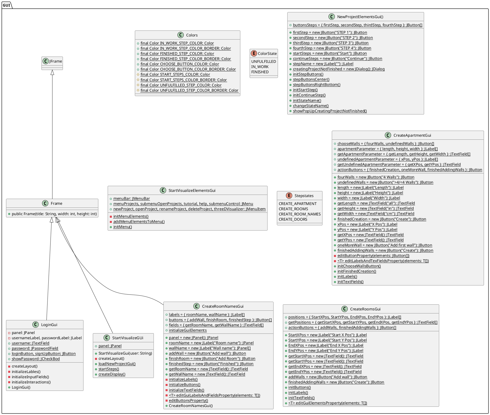

```plantuml
@startuml

namespace GUI {
    class Frame extends JFrame {
        + public Frame(title: String, width: int, height: int)
    }

    class LoginGui extends Frame{
        - panel: JPanel
        - usernameLabel, passwordLabel: JLabel
        {static} + username: JTextField        
        {static} + password: JPasswordField         
        {static} + loginButton, signUpButton: JButton       
        {static} + showPassword: JCheckBod
        - createLayout()
        - initializeLables()
        - initializeInputFields()
        - initializeInteractions()
        + LoginGui()
    }

    class StartVisualizeGUi extends Frame {
        {static} + panel: JPanel
        + StartVisualizeGui(user: String)
        - createLayout()
        {static} + loadNewProjectGui()
        {static} + startSteps()
        {static} + createDisplay()
    }

    class Colors {
        {static} + final Color IN_WORK_STEP_COLOR: Color
        {static} + final Color IN_WORK_STEP_COLOR_BORDER: Color
        {static} + final Color FINISHED_STEP_COLOR: Color
        {static} + final Color FINISHED_STEP_COLOR_BORDER: Color
        {static} + final Color CHOOSE_BUTTON_COLOR: Color
        {static} + final Color CHOOSE_BUTTON_COLOR_BORDER: Color
        {static} # final Color START_STEPS_COLOR: Color
        {static} # final Color START_STEPS_COLOR_BORDER: Color
        {static} # final Color UNFULFILLED_STEP_COLOR: Color
        {static} # final Color UNFULFILLED_STEP_COLOR_BORDER: Color
    }

    enum ColorState {
        UNFULFILLED
        IN_WORK
        FINISHED
    }

    class NewProjectElementsGui() {
        {static} + firstStep = new JButton("STEP 1"): JButton
        {static} + secondStep = new JButton("STEP 2"): JButton
        {static} + thirdStep = new JButton("STEP 3"): JButton
        {static} + fourthStep = new JButton("STEP 4"): JButton
        {static} + buttonsSteps = { firstStep, secondStep, thirdStep, fourthStep }: JButton[]
        {static} + startSteps = new JButton("Start"): JButton
        {static} + continueSteps = new JButton("Continue"): JButton
        {static} + stepName = new JLabel(""): JLabel
        {static} + creatingProjectNotFinished = new JDialog(): JDialog
        {static} + initStepButtons()
        {static} + stepButtonsCenter()
        {static} + stepButtonsRightBottom()
        {static} + initStartStep()
        {static} + initContinueStep()
        {static} + initStateName()
        {static} + changeStateName()
        {static} + showPopUpCreatingProjectNotFinished()
    }

    class StartVisualizeElementsGui{
        {static} + menuBar: JMenuBar
        {static} + menuProjects, submenuOpenProjects, tutorial, help, submenuControl: JMenu
        {static} + newProject, openProject, renameProject, deleteProject, threeDVisualizer: JMenuItem
        {static} - initMenuElements()
        {static} - addMenuElementsToMenu()
        {static} + initMenu()
    }

    enum Stepstates{
        CREATE_APARTMENT
        CREATE_ROOMS
        CREATE_ROOM_NAMES
        CREATE_DOORS
    }

    class CreateApartmentGui{
        {static} + fourWalls = new JButton("4 Walls"): JButton
        {static} + undefinedWalls = new JButton(">4/<4 Walls"): JButton
        {static} + chooseWalls = { fourWalls, undefinedWalls }: JButton[]
        {static} + length = new JLabel("Length"): JLabel
        {static} + height = new JLabel("Height"): JLabel
        {static} + width = new JLabel("Width"): JLabel
        {static} + apartmentParameter = { length, height, width }: JLabel[]
        {static} + getLength = new JTextField("all"): JTextField
        {static} + getHeight = new JTextField("in"): JTextField
        {static} + getWidth = new JTextField("cm"): JTextField
        {static} + getApartmentParameter = { getLength, getHeight, getWidth }: JTextField[]
        {static} + finishedCreation = new JButton("Create"): JButton
        {static} + xPos = new JLabel("X Pos"): JLabel
        {static} + yPos = new JLabel("Y Pos"): JLabel
        {static} + undefinedApartmentParameter = { xPos, yPos }: JLabel[]
        {static} + getXPos = new JTextField(): JTextField
        {static} + getYPos = new JTextField(): JTextField
        {static} + getUndefinedApartmentParameter = { getXPos, getYPos }: JTextField
        {static} +  oneMoreWall = new JButton("Add first wall"): JButton
        {static} + finishedAddingWalls = new JButton("Create"): JButton
        {static} + actionButtons = { finishedCreation, oneMoreWall, finishedAddingWalls }: JButton
        {static} - editButtonProperty(elements: JButton[]) 
        {static} - <T> editLabelsAndTexFieldsProperty(elements: T[])
        {static} + initChooseWallsButton()
        {static} + initFinishedCreation()
        {static} + initLabels()
        {static} + initTextFields()
    }

    class CreateRoomsGui{
        {static} + StartXPos = new JLabel("Start X Pos"): JLabel 
        {static} + StartYPos = new JLabel("Start Y Pos"): JLabel 
        {static} + EndXPos = new JLabel("End X Pos"): JLabel 
        {static} + EndYPos = new JLabel("End Y Pos"): JLabel 
        {static} + positions = { StartXPos, StartYPos, EndXPos, EndYPos }: JLabel[] 
        {static} + getStartXPos = new JTextField(): JTextField
        {static} + getStartYPos = new JTextField(): JTextField
        {static} + getEndXPos = new JTextField(): JTextField
        {static} + getEndYPos = new JTextField(): JTextField
        {static} + getPositions = { getStartXPos, getStartYPos, getEndXPos, getEndYPos }: JTextField[]
        {static} + addWalls = new JButton("Add wall"): JButton
        {static} + finishedAddingWalls = new JButton("Create"): JButton
        {static} + actionButtons = { addWalls, finishedAddingWalls }: JButton[]
        {static} + initButtons()
        {static} + initLabels()
        {static} + initTextFields()
        {static} + <T> editGuiElementsProperty(elements: T[])
    }

    class CreateRoomNamesGui extends Frame {
        {static} + panel = new JPanel(): JPanel
        {static} + roomName = new JLabel("Room name"): JPanel
        {static} + wallName = new JLabel("Wall name"): JPanel[]
        {static} + labels = { roomName, wallName }: JLabel[] 
        {static} + addWall = new JButton("Add wall"): JButton
        {static} + finishRoom = new JButton("Add Room"): JButton 
        {static} + finishedStep = new JButton("Finished"): JButton 
        {static} + buttons = { addWall, finishRoom, finishedStep }: JButton[]
        {static} + getRoomName = new JTextField(): JTextField
        {static} + getWallName = new JTextField(): JTextField
        {static} + fields = { getRoomName, getWallName }: JTextField[]
        {static} + initializeGuiElements 
        {static} - initializeLabels()
        {static} - initializeButtons()
        {static} - initializeTextFields()
        {static} - <T> editGuiLabelsAndFieldsProperty(elements: T[]) 
        {static} - editButtonsProperty()
        + CreateRoomNamesGui()
    }
}

@enduml

```