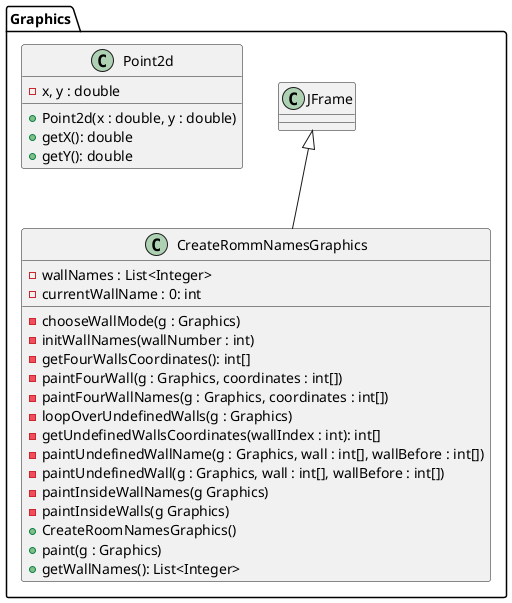

```plantuml
@startuml

namespace Graphics {
    class CreateRommNamesGraphics extends JFrame{      
        - wallNames : List<Integer>
        - currentWallName : 0: int
        - chooseWallMode(g : Graphics)
        - initWallNames(wallNumber : int)
        - getFourWallsCoordinates(): int[]
        - paintFourWall(g : Graphics, coordinates : int[])
        - paintFourWallNames(g : Graphics, coordinates : int[])
        - loopOverUndefinedWalls(g : Graphics)
        - getUndefinedWallsCoordinates(wallIndex : int): int[]
        - paintUndefinedWallName(g : Graphics, wall : int[], wallBefore : int[])
        - paintUndefinedWall(g : Graphics, wall : int[], wallBefore : int[])
        - paintInsideWallNames(g Graphics)
        - paintInsideWalls(g Graphics)
        + CreateRoomNamesGraphics()
        + paint(g : Graphics)
        + getWallNames(): List<Integer>

    }

    class Point2d{
        - x, y : double
        + Point2d(x : double, y : double)
        + getX(): double
        + getY(): double
    }
}

@enduml

```