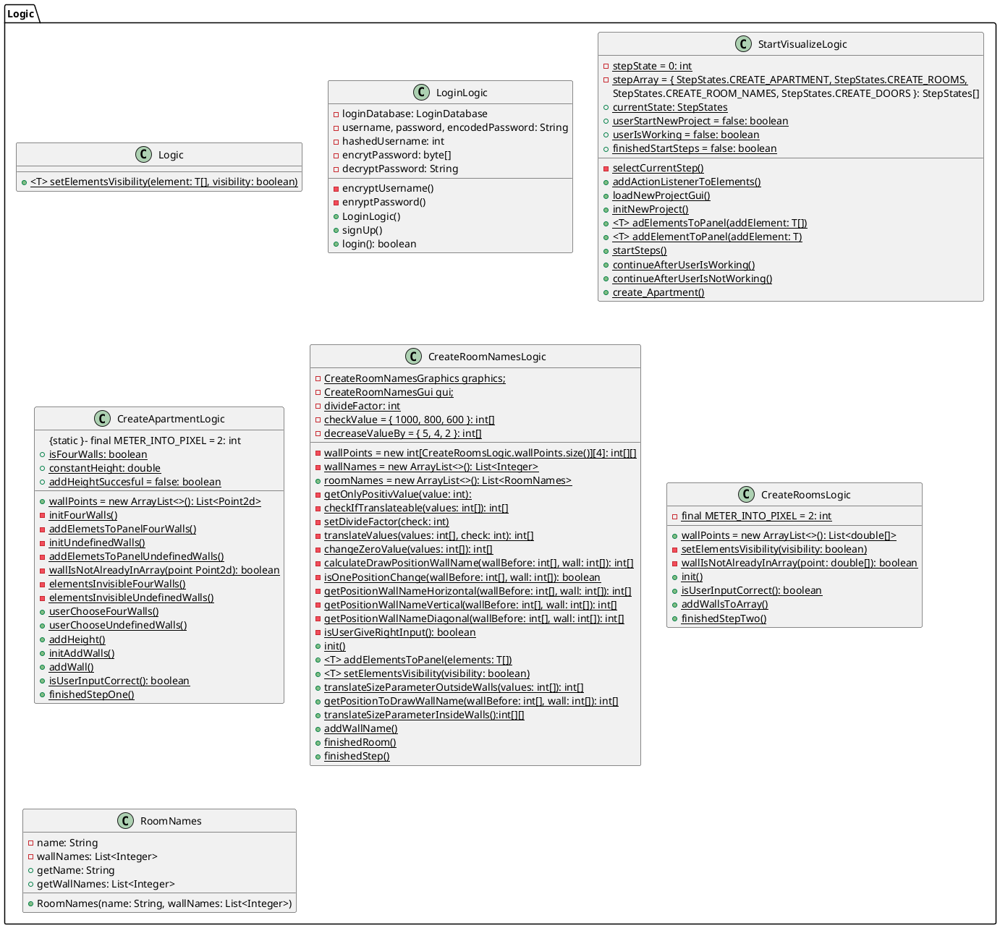

```plantuml
@startuml

namespace Logic {
    class Logic {
        {static} + <T> setElementsVisibility(element: T[], visibility: boolean)
    }

    class LoginLogic {
        - loginDatabase: LoginDatabase
        - username, password, encodedPassword: String
        - hashedUsername: int
        - encrytPassword: byte[]
        - encryptUsername()
        - enryptPassword()
        - decryptPassword: String
        + LoginLogic()
        + signUp()
        + login(): boolean
    }

    class StartVisualizeLogic{
        {static} - stepState = 0: int
        {static} - stepArray = { StepStates.CREATE_APARTMENT, StepStates.CREATE_ROOMS,
        StepStates.CREATE_ROOM_NAMES, StepStates.CREATE_DOORS }: StepStates[]
        {static} + currentState: StepStates
        {static} + userStartNewProject = false: boolean
        {static} + userIsWorking = false: boolean
        {static} + finishedStartSteps = false: boolean
        {static} - selectCurrentStep()
        {static} + addActionListenerToElements() 
        {static} + loadNewProjectGui()
        {static} + initNewProject()
        {static} + <T> adElementsToPanel(addElement: T[])
        {static} + <T> addElementToPanel(addElement: T)
        {static} + startSteps()        
        {static} + continueAfterUserIsWorking()
        {static} + continueAfterUserIsNotWorking()
        {static} + create_Apartment()
    }

    class CreateApartmentLogic{
        {static }- final METER_INTO_PIXEL = 2: int
        {static} + isFourWalls: boolean
        {static} + constantHeight: double
        {static} + addHeightSuccesful = false: boolean
        {static} +  wallPoints = new ArrayList<>(): List<Point2d>
        {static} - initFourWalls()
        {static} - addElemetsToPanelFourWalls()
        {static} - initUndefinedWalls()
        {static} - addElemetsToPanelUndefinedWalls()
        {static} - wallIsNotAlreadyInArray(point Point2d): boolean
        {static} - elementsInvisibleFourWalls()
        {static} - elementsInvisibleUndefinedWalls()
        {static} + userChooseFourWalls()
        {static} + userChooseUndefinedWalls()
        {static} + addHeight()
        {static} + initAddWalls()
        {static} + addWall()
        {static} + isUserInputCorrect(): boolean
        {static} + finishedStepOne()
    }

    class CreateRoomNamesLogic{
        {static} - CreateRoomNamesGraphics graphics;
        {static} - CreateRoomNamesGui gui;
        {static} - divideFactor: int
        {static} - checkValue = { 1000, 800, 600 }: int[]
        {static} - decreaseValueBy = { 5, 4, 2 }: int[]
        {static} - wallPoints = new int[CreateRoomsLogic.wallPoints.size()][4]: int[][]
        {static} - wallNames = new ArrayList<>(): List<Integer>
        {static} + roomNames = new ArrayList<>(): List<RoomNames>
        {static} - getOnlyPositivValue(value: int): 
        {static} - checkIfTranslateable(values: int[]): int[]
        {static} - setDivideFactor(check: int)
        {static} - translateValues(values: int[], check: int): int[]
        {static} - changeZeroValue(values: int[]): int[]
        {static} - calculateDrawPositionWallName(wallBefore: int[], wall: int[]): int[]
        {static} - isOnePositionChange(wallBefore: int[], wall: int[]): boolean
        {static} - getPositionWallNameHorizontal(wallBefore: int[], wall: int[]): int[]
        {static} - getPositionWallNameVertical(wallBefore: int[], wall: int[]): int[]
        {static} - getPositionWallNameDiagonal(wallBefore: int[], wall: int[]): int[]
        {static} - isUserGiveRightInput(): boolean
        {static} + init()
        {static} + <T> addElementsToPanel(elements: T[])
        {static} + <T> setElementsVisibility(visibility: boolean)
        {static} + translateSizeParameterOutsideWalls(values: int[]): int[]
        {static} + getPositionToDrawWallName(wallBefore: int[], wall: int[]): int[]
        {static} + translateSizeParameterInsideWalls():int[][]
        {static} + addWallName()
        {static} + finishedRoom()
        {static} + finishedStep()
    }

    class CreateRoomsLogic{
        {static} - final METER_INTO_PIXEL = 2: int 
        {static} + wallPoints = new ArrayList<>(): List<double[]>
        {static} - setElementsVisibility(visibility: boolean)
        {static} - wallIsNotAlreadyInArray(point: double[]): boolean
        {static} + init()
        {static} + isUserInputCorrect(): boolean
        {static} + addWallsToArray()
        {static} + finishedStepTwo()
    }

    class RoomNames {
        - name: String
        - wallNames: List<Integer>
        + RoomNames(name: String, wallNames: List<Integer>)
        + getName: String
        + getWallNames: List<Integer>
    }
}

@enduml
```