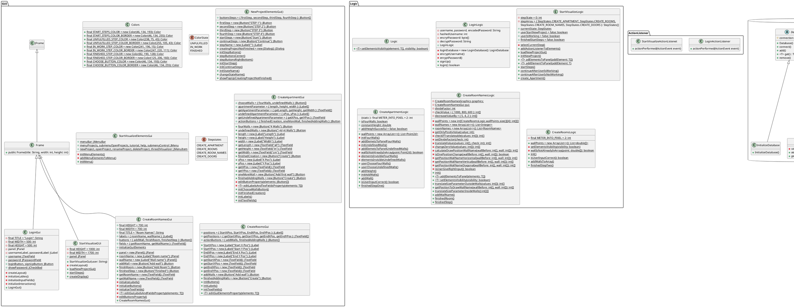

```plantuml
@startuml

namespace ActionListener {
    class LoginActionListener {
        + actionPerformed(ActionEvent event)
    }

    class StartVisualizeActionListenet {
        + actionPerformed(ActionEvent event)
    }
}

package Database <<Database>> {
    abstract class Database {
        # connection : Connection  
        + Database()
        + connect()
        + add()
        + <T> get() : T[]
        + remove()
    }

    class InitializeDatabase extends Database {
        + InitializeDatabase()
    }

    class LoginDatabase extends Database {
        - userNotInDatabase(username : int): boolean
        {abstract} + add(username : int, password : String)
        {abstract} + get(username : int): String
    }
}

namespace Encryption {
    class Hash {
        {static} + hashUsername(username : Strings): int
    }

    class RsaEncryption {
        {static} - getPublicKey(): PublicKey
        {static} - getPrivateKey(): PrivateKey
        {static} + enrcypt(message : String): byte[]
        {static} + decrypt(message : byte[]): String
    }
}

namespace Graphics {
    class CreateRommNamesGraphics extends JFrame{
        {static} - final HEIGHT : int            
        {static} - final WIDTH : int        
        {static} - final METER_INTO_PIXEL : int     
        - wallNames : List<Integer>
        - currentWallName : 0
        - chooseWallMode(g : Graphics)
        - initWallNames(wallNumber : int)
        - getFourWallsCoordinates(): int[]
        - paintFourWall(g : Graphics, coordinates : int[])
        - paintFourWallNames(g : Graphics, coordinates : int[])
        - loopOverUndefinedWalls(g : Graphics)
        - getUndefinedWallsCoordinates(wallIndex : int): int[]
        - paintUndefinedWallName(g : Graphics, wall : int[], wallBefore : int[])
        - paintUndefinedWall(g : Graphics, wall : int[], wallBefore : int[])
        - paintInsideWallNames(g Graphics)
        - paintInsideWalls(g Graphics)
        + CreateRoomNamesGraphics()
        + paint(g : Graphics)
        + getWallNames(): List<Integer>

    }

    class Point2d{
        - x, y : double
        + Point2d(x : double, y : double)
        + getX(): double
        + getY(): double
    }
}


namespace GUI {
    class Frame extends JFrame {
        + public Frame(title: String, width: int, height: int)
    }

    class LoginGui extends Frame{
        {static} - final TITLE = "Login": String
        {static} - final WIDTH = 500: int
        {static} - final HEIGHT = 500: int
        - panel: JPanel
        - usernameLabel, passwordLabel: JLabel
        {static} + username: JTextField        
        {static} + password: JPasswordField         
        {static} + loginButton, signUpButton: JButton       
        {static} + showPassword: JCheckBod
        - createLayout()
        - initializeLables()
        - initializeInputFields()
        - initializeInteractions()
        + LoginGui()
    }

    class StartVisualizeGUi extends Frame {
        {static} - final HEIGHT = 1000: int
        {static} - final WIDTH = 1700: int
        {static} + panel: JPanel
        + StartVisualizeGui(user: String)
        - createLayout()
        {static} + loadNewProjectGui()
        {static} + startSteps()
        {static} + createDisplay()
    }

    class Colors {
        {static} +  final START_STEPS_COLOR = new Color(46, 134, 193): Color
        {static} +  final START_STEPS_COLOR_BORDER = new Color(46, 134, 255): Color
        {static} +  final UNFULFILLED_STEP_COLOR = new Color(238, 75, 43): Color
        {static} +  final UNFULFILLED_STEP_COLOR_BORDER = new Color(255, 105, 43): Color
        {static} +  final IN_WORK_STEP_COLOR = new Color(241, 196, 15): Color
        {static} +  final IN_WORK_STEP_COLOR_BORDER = new Color(247, 220, 111): Color
        {static} +  final FINISHED_STEP_COLOR = new Color(82, 190, 128): Color
        {static} +  final FINISHED_STEP_COLOR_BORDER = new Color(125, 206, 160): Color
        {static} +  final CHOOSE_BUTTON_COLOR = new Color(46, 134, 193): Color
        {static} +  final CHOOSE_BUTTON_COLOR_BORDER = new Color(46, 134, 255): Color
    }

    enum ColorState {
        UNFULFILLED
        IN_WORK
        FINISHED
    }

    class NewProjectElementsGui() {
        {static} + firstStep = new JButton("STEP 1"): JButton
        {static} + secondStep = new JButton("STEP 2"): JButton
        {static} + thirdStep = new JButton("STEP 3"): JButton
        {static} + fourthStep = new JButton("STEP 4"): JButton
        {static} + buttonsSteps = { firstStep, secondStep, thirdStep, fourthStep }: JButton[]
        {static} + startSteps = new JButton("Start"): JButton
        {static} + continueSteps = new JButton("Continue"): JButton
        {static} + stepName = new JLabel(""): JLabel
        {static} + creatingProjectNotFinished = new JDialog(): JDialog
        {static} + initStepButtons()
        {static} + stepButtonsCenter()
        {static} + stepButtonsRightBottom()
        {static} + initStartStep()
        {static} + initContinueStep()
        {static} + initStateName()
        {static} + changeStateName()
        {static} + showPopUpCreatingProjectNotFinished()
    }

    class StartVisualizeElementsGui{
        {static} + menuBar: JMenuBar
        {static} + menuProjects, submenuOpenProjects, tutorial, help, submenuControl: JMenu
        {static} + newProject, openProject, renameProject, deleteProject, threeDVisualizer: JMenuItem
        {static} - initMenuElements()
        {static} - addMenuElementsToMenu()
        {static} + initMenu()
    }

    enum Stepstates{
        CREATE_APARTMENT
        CREATE_ROOMS
        CREATE_ROOM_NAMES
        CREATE_DOORS
    }

    class CreateApartmentGui{
        {static} + fourWalls = new JButton("4 Walls"): JButton
        {static} + undefinedWalls = new JButton(">4/<4 Walls"): JButton
        {static} + chooseWalls = { fourWalls, undefinedWalls }: JButton[]
        {static} + length = new JLabel("Length"): JLabel
        {static} + height = new JLabel("Height"): JLabel
        {static} + width = new JLabel("Width"): JLabel
        {static} + apartmentParameter = { length, height, width }: JLabel[]
        {static} + getLength = new JTextField("all"): JTextField
        {static} + getHeight = new JTextField("in"): JTextField
        {static} + getWidth = new JTextField("cm"): JTextField
        {static} + getApartmentParameter = { getLength, getHeight, getWidth }: JTextField[]
        {static} + finishedCreation = new JButton("Create"): JButton
        {static} + xPos = new JLabel("X Pos"): JLabel
        {static} + yPos = new JLabel("Y Pos"): JLabel
        {static} + undefinedApartmentParameter = { xPos, yPos }: JLabel[]
        {static} + getXPos = new JTextField(): JTextField
        {static} + getYPos = new JTextField(): JTextField
        {static} + getUndefinedApartmentParameter = { getXPos, getYPos }: JTextField
        {static} +  oneMoreWall = new JButton("Add first wall"): JButton
        {static} + finishedAddingWalls = new JButton("Create"): JButton
        {static} + actionButtons = { finishedCreation, oneMoreWall, finishedAddingWalls }: JButton
        {static} - editButtonProperty(elements: JButton[]) 
        {static} - <T> editLabelsAndTexFieldsProperty(elements: T[])
        {static} + initChooseWallsButton()
        {static} + initFinishedCreation()
        {static} + initLabels()
        {static} + initTextFields()
    }

    class CreateRoomsGui{
        {static} + StartXPos = new JLabel("Start X Pos"): JLabel 
        {static} + StartYPos = new JLabel("Start Y Pos"): JLabel 
        {static} + EndXPos = new JLabel("End X Pos"): JLabel 
        {static} + EndYPos = new JLabel("End Y Pos"): JLabel 
        {static} + positions = { StartXPos, StartYPos, EndXPos, EndYPos }: JLabel[] 
        {static} + getStartXPos = new JTextField(): JTextField
        {static} + getStartYPos = new JTextField(): JTextField
        {static} + getEndXPos = new JTextField(): JTextField
        {static} + getEndYPos = new JTextField(): JTextField
        {static} + getPositions = { getStartXPos, getStartYPos, getEndXPos, getEndYPos }: JTextField[]
        {static} + addWalls = new JButton("Add wall"): JButton
        {static} + finishedAddingWalls = new JButton("Create"): JButton
        {static} + actionButtons = { addWalls, finishedAddingWalls }: JButton[]
        {static} + initButtons()
        {static} + initLabels()
        {static} + initTextFields()
        {static} + <T> editGuiElementsProperty(elements: T[])
    }

    class CreateRoomNamesGui extends Frame {
        {static} + final HEIGHT = 700: int
        {static} + final WIDTH = 700: int
        {static} + final TITLE = "Room Names": String
        {static} + panel = new JPanel(): JPanel
        {static} + roomName = new JLabel("Room name"): JPanel
        {static} + wallName = new JLabel("Wall name"): JPanel[]
        {static} + labels = { roomName, wallName }: JLabel[] 
        {static} + addWall = new JButton("Add wall"): JButton
        {static} + finishRoom = new JButton("Add Room"): JButton 
        {static} + finishedStep = new JButton("Finished"): JButton 
        {static} + buttons = { addWall, finishRoom, finishedStep }: JButton[]
        {static} + getRoomName = new JTextField(): JTextField
        {static} + getWallName = new JTextField(): JTextField
        {static} + fields = { getRoomName, getWallName }: JTextField[]
        {static} + initializeGuiElements 
        {static} - initializeLabels()
        {static} - initializeButtons()
        {static} - initializeTextFields()
        {static} - <T> editGuiLabelsAndFieldsProperty(elements: T[]) 
        {static} - editButtonsProperty()
        + CreateRoomNamesGui()
    }
}

namespace Logic {
    class Logic {
        {static} + <T> setElementsVisibility(element: T[], visibility: boolean)
    }

    class LoginLogic {
        - loginDatabase = new LoginDatabase(): LoginDatabase
        - username, password, encodedPassword: String
        - hashedUsername: int
        - encrytPassword: byte[]
        - encryptUsername()
        - enryptPassword()
        - decryptPassword: String
        + LoginLogic
        + signUp()
        + login(): boolean
    }

    class StartVisualizeLogic{
        {static} - stepState = 0: int
        {static} - stepArray = { StepStates.CREATE_APARTMENT, StepStates.CREATE_ROOMS,
        StepStates.CREATE_ROOM_NAMES, StepStates.CREATE_DOORS }: StepStates[]
        {static} + currentState: StepStates
        {static} + userStartNewProject = false: boolean
        {static} + userIsWorking = false: boolean
        {static} + finishedStartSteps = false: boolean
        {static} - selectCurrentStep()
        {static} + addActionListenerToElements() 
        {static} + loadNewProjectGui()
        {static} + initNewProject()
        {static} + <T> adElementsToPanel(addElement: T[])
        {static} + <T> addElementToPanel(addElement: T)
        {static} + startSteps()        
        {static} + continueAfterUserIsWorking()
        {static} + continueAfterUserIsNotWorking()
        {static} + create_Apartment()
    }

    class CreateApartmentLogic{
        {static }- final METER_INTO_PIXEL = 2: int
        {static} + isFourWalls: boolean
        {static} + constantHeight: double
        {static} + addHeightSuccesful = false: boolean
        {static} +  wallPoints = new ArrayList<>(): List<Point2d>
        {static} - initFourWalls()
        {static} - addElemetsToPanelFourWalls()
        {static} - initUndefinedWalls()
        {static} - addElemetsToPanelUndefinedWalls()
        {static} - wallIsNotAlreadyInArray(point Point2d): boolean
        {static} - elementsInvisibleFourWalls()
        {static} - elementsInvisibleUndefinedWalls()
        {static} + userChooseFourWalls()
        {static} + userChooseUndefinedWalls()
        {static} + addHeight()
        {static} + initAddWalls()
        {static} + addWall()
        {static} + isUserInputCorrect(): boolean
        {static} + finishedStepOne()
    }

    class CreateRoomNamesLogic{
        {static} - CreateRoomNamesGraphics graphics;
        {static} - CreateRoomNamesGui gui;
        {static} - divideFactor: int
        {static} - checkValue = { 1000, 800, 600 }: int[]
        {static} - decreaseValueBy = { 5, 4, 2 }: int[]
        {static} - wallPoints = new int[CreateRoomsLogic.wallPoints.size()][4]: int[][]
        {static} - wallNames = new ArrayList<>(): List<Integer>
        {static} + roomNames = new ArrayList<>(): List<RoomNames>
        {static} - getOnlyPositivValue(value: int): 
        {static} - checkIfTranslateable(values: int[]): int[]
        {static} - setDivideFactor(check: int)
        {static} - translateValues(values: int[], check: int): int[]
        {static} - changeZeroValue(values: int[]): int[]
        {static} - calculateDrawPositionWallName(wallBefore: int[], wall: int[]): int[]
        {static} - isOnePositionChange(wallBefore: int[], wall: int[]): boolean
        {static} - getPositionWallNameHorizontal(wallBefore: int[], wall: int[]): int[]
        {static} - getPositionWallNameVertical(wallBefore: int[], wall: int[]): int[]
        {static} - getPositionWallNameDiagonal(wallBefore: int[], wall: int[]): int[]
        {static} - isUserGiveRightInput(): boolean
        {static} + init()
        {static} + <T> addElementsToPanel(elements: T[])
        {static} + <T> setElementsVisibility(visibility: boolean)
        {static} + translateSizeParameterOutsideWalls(values: int[]): int[]
        {static} + getPositionToDrawWallName(wallBefore: int[], wall: int[]): int[]
        {static} + translateSizeParameterInsideWalls():int[][]
        {static} + addWallName()
        {static} + finishedRoom()
        {static} + finishedStep()
    }

    class CreateRoomsLogic{
        {static} - final METER_INTO_PIXEL = 2: int 
        {static} + wallPoints = new ArrayList<>(): List<double[]>
        {static} - setElementsVisibility(visibility: boolean)
        {static} - wallIsNotAlreadyInArray(point: double[]): boolean
        {static} + init()
        {static} + isUserInputCorrect(): boolean
        {static} + addWallsToArray()
        {static} + finishedStepTwo()
    }
}

@enduml
```