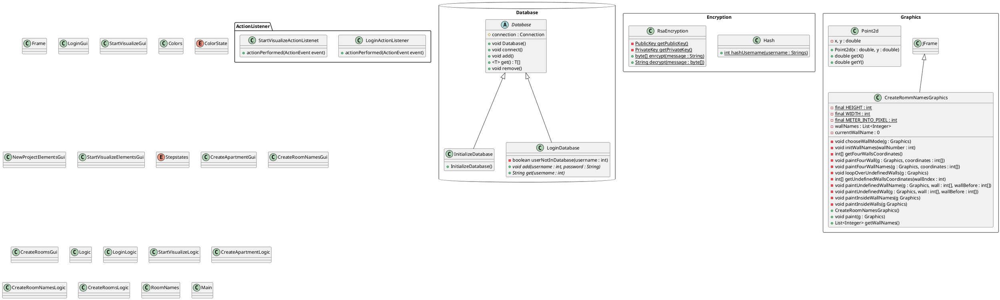

```plantuml
@startuml
namespace ActionListener {
    class LoginActionListener{
        + actionPerformed(ActionEvent event)
    }

    class StartVisualizeActionListenet{
        + actionPerformed(ActionEvent event)
    }
}

package Database <<Database>> {
    abstract class Database{
        # connection : Connection  
        + void Database()
        + void connect()
        + void add()
        + <T> get() : T[]
        + void remove()
    }
    class InitializeDatabase extends Database{
        + InitializeDatabase()
    }
    class LoginDatabase extends Database{
        - boolean userNotInDatabase(username : int)
        {abstract} + void add(username : int, password : String)
        {abstract} + String get(username : int)
    } 
}

package Encryption <<Rectangle>> {
    class Hash{
        {static} + int hashUsername(username : Strings)
    }
    class RsaEncryption{
        {static} - PublicKey getPublicKey()
        {static} - PrivateKey getPrivateKey()
        {static} + byte[] enrcypt(message : String)
        {static} + String decrypt(message : byte[])
    }
}

package Graphics <<Rectangle>> {
    class CreateRommNamesGraphics extends JFrame{
        {static} - final HEIGHT : int            
        {static} - final WIDTH : int        
        {static} - final METER_INTO_PIXEL : int     
        - wallNames : List<Integer>
        - currentWallName : 0
        - void chooseWallMode(g : Graphics)
        - void initWallNames(wallNumber : int)
        - int[] getFourWallsCoordinates()
        - void paintFourWall(g : Graphics, coordinates : int[])
        - void paintFourWallNames(g : Graphics, coordinates : int[])
        - void loopOverUndefinedWalls(g : Graphics)
        - int[] getUndefinedWallsCoordinates(wallIndex : int)
        - void paintUndefinedWallName(g : Graphics, wall : int[], wallBefore : int[])
        - void paintUndefinedWall(g : Graphics, wall : int[], wallBefore : int[])
        - void paintInsideWallNames(g Graphics)
        - void paintInsideWalls(g Graphics)
        + CreateRoomNamesGraphics()
        + void paint(g : Graphics)
        + List<Integer> getWallNames()

    }
    class Point2d{
        - x, y : double
        + Point2d(x : double, y : double)
        + double getX()
        + double getY()
    }
}


class Frame{}
class LoginGui{}
class StartVisualizeGui{}
class Colors{}
enum ColorState
class NewProjectElementsGui{}
class StartVisualizeElementsGui{}
enum Stepstates{}
class CreateApartmentGui{}
class CreateRoomNamesGui{}
class CreateRoomsGui{}
class Logic{}
class LoginLogic{}
class StartVisualizeLogic{}
class CreateApartmentLogic{}
class CreateRoomNamesLogic{}
class CreateRoomsLogic{}
class RoomNames{}


class Main{}
@enduml
```